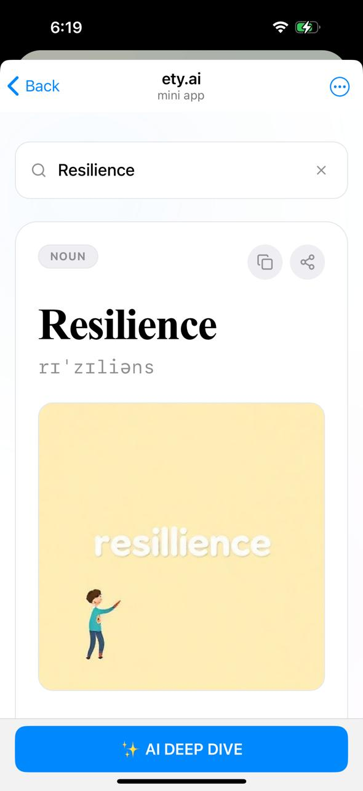

# Ety.ai 🚀

**Discover the story behind words — directly inside Telegram.**

Ety.ai is a **full‑stack, serverless, AI‑powered web application** deeply integrated with the Telegram ecosystem. It transforms simple word searches into rich explorations of **etymology, linguistic roots, summaries, visuals, and voice narration**, wrapped in a gamified learning experience.

---

## 🔗 Live Links

- **Vercel App:** [https://ety-app.vercel.app/](https://ety-app.vercel.app/)  
- **Telegram Bot:** [https://t.me/newetybot](https://t.me/newetybot)

---

## ✨ Key Features

* 🔍 **AI‑Powered Word Discovery** – Etymology, roots, phonetics, synonyms & fun facts
* 🧠 **Deep Dive Summaries** – Encyclopedia‑style explanations generated on demand
* 🎙️ **Voice Narrator (TTS)** – High‑quality AI narration with real-time audio encoding
* 🎨 **AI Visuals** – Context-aware illustrations generated per word
* 🏆 **Gamification Engine** – XP, levels, badges, streaks & global leaderboard
* 📲 **Native Telegram Integration** – Main Button, Back Button, haptics & theme sync
* ⚡ **Serverless & Scalable** – Built for speed, reliability, and low latency

---

## 🏗️ High‑Level Architecture

**Frontend**

* React (Vite)
* TypeScript
* Tailwind CSS
* Lucide Icons

**Backend**

* Vercel Serverless Functions
* Node.js + TypeScript

**Database**

* MongoDB (users, history, XP, leaderboards)

**AI Stack**

* **Google Gemini 3 Flash** – Complex reasoning & summaries
* **Google Gemini 2.5 Flash** – TTS & lightweight generations
* **Pollinations AI** – Image generation

**Media Processing**

* Raw PCM → WAV conversion (client‑side, real-time)

---

## 🔄 Core Workflows

### A. Search & Discovery

1. User searches a word (e.g. *Galaxy*)
2. **Hybrid Cache System**
   * L1: `localStorage`
   * L2: Server in-memory cache + MongoDB
3. AI generates structured JSON:
   * Etymology
   * Linguistic roots
   * Phonetics & synonyms
   * Fun facts
4. AI visual is generated in parallel for instant engagement

### B. AI Deep Dive ✨

* Triggered via **Telegram Main Button**
* Generates a 4–6 sentence encyclopedia-style summary
* Stored permanently in user history (no repeated XP cost)

### C. Voice Narrator 🎧

1. TTS request sent to server
2. Gemini generates raw PCM audio
3. Frontend:
   * Decodes Base64
   * Converts to `Int16Array`
   * Wraps with RIFF/WAV header
4. Plays instantly via `AudioContext`

Optimized for **mobile audio driver alignment**.

---

## 🎮 Gamification System

### XP Triggers

| Action      | XP  |
| ----------- | --- |
| Search      | 15  |
| Summary     | 30  |
| Share       | 50  |
| Daily Visit | 100 |

### Levels

* Progressive formula
* Early levels are fast
* Higher tiers (e.g. **Grand Sage**) require deep engagement

### Badges

* 🧠 **Scholar** – Discoveries
* 🌟 **Visionary** – Summaries
* 📣 **Ambassador** – Shares
* 🔥 **Devotee** – Streaks

---

## 📲 Telegram Integration

* 🔗 **Inline Sharing** – Share word cards to any chat
* 🎯 **Deep Links** – “Explore More” CTA
* 📳 **Haptic Feedback** – Search, success, warnings
* 🎛️ **Native Controls** – Main Button & Back Button
* 🎨 **Theme Sync** – Auto adapts to Telegram light/dark/custom themes
* 🌗 **Auto Dark / Light Mode** – UI automatically toggles based on the user’s **mobile system theme**

---

## 🛡️ Technical Resilience

### API Rate‑Limit Protection

> ⚠️ **Note on AI Limits**  
> This project currently uses **unpaid / free-tier AI APIs**, which may occasionally result in **rate-limit or quota errors (e.g., 429 responses)** during high usage.

To ensure smooth experience:

* 🔁 **Sequential API Key Rotation** – Iterates through up to 5 API keys automatically
* 🤝 **Graceful Fallbacks** – Returns friendly mock responses if all keys are exhausted
* ⏱️ **Temporary Caching** – Mock responses are cached for 5 minutes to prevent UI breaks

### Audio Stability

* Strict PCM byte-alignment
* Ensures glitch-free playback on mobile devices

---

## 🧭 User Journey

1. **Start** – User opens the bot and clicks *Launch*
2. **Engage** – Searches words, earns XP, sees AI visuals
3. **Deepen** – Unlocks Deep Dives & listens to narration
4. **Socialize** – Shares results, earns Ambassador badge
5. **Compete** – Checks profile & global leaderboard

---

## 🤖 Telegram Bot Usage & Demo

1. Open the Telegram bot  
2. Tap **Launch** to open the Web App  
3. Type a word in the search bar (e.g., `Galaxy`)  
4. Instantly receive:
   * Etymology & linguistic roots
   * AI-generated visual
   * XP rewards

**Deep Dive Flow**  

* Tap **✨ AI DEEP DIVE** button
* Receive an encyclopedia-style explanation
* Summary is saved permanently

**Voice Narration**  

* Tap 🎧 narrator button
* Hear AI-generated voice

**Inline Sharing**  

* Tap **Share**
* Choose any chat or group
* Bot posts a rich **Word Card** with formatted text, emoji highlights, and **🔎 Explore More** deep link

**Native Telegram Features Used**

* Main & Back Button
* Inline query switching (`switchInlineQuery`)
* Haptic feedback
* Auto Dark/Light theme sync

---

## 📸 Screenshots & Demo

### 1️⃣ Bot Launch & Home Screen

### 2️⃣ Word Search & AI Discovery

### 3️⃣ AI Deep Dive (Main Button)

### 4️⃣ Words History

### 5️⃣ Profile, XP & Global Leaderboard

---

## 🚀 Deployment

* **Frontend & Backend**: Vercel
* **Database**: MongoDB Atlas
* **Environment Secrets**: Managed via Vercel ENV

---

## 📌 Vision

Ety.ai is not just a dictionary — it’s a **learning loop**.  
By combining AI, gamification, and social sharing inside Telegram, Ety.ai turns curiosity into a daily habit and learning into play.

---

## 👤 Author

**Sayad Akbar**  
Full‑Stack Developer • AI Builder • Open‑Source Enthusiast

---

⭐ If you like this project, consider starring the repository and sharing it with fellow developers!
